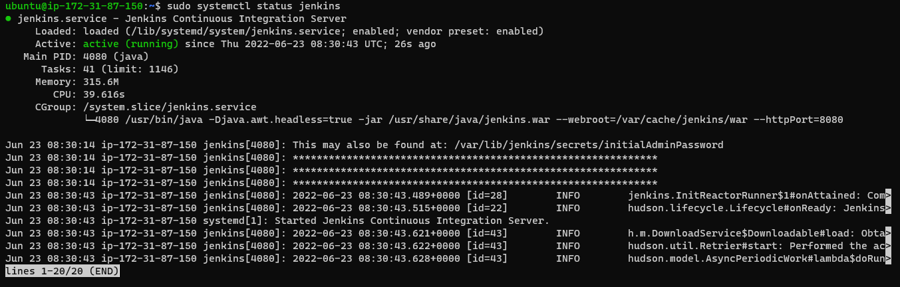
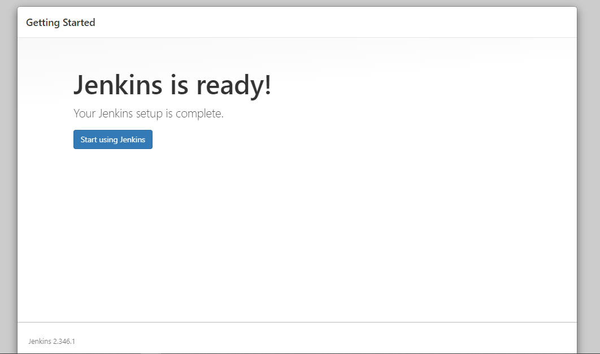
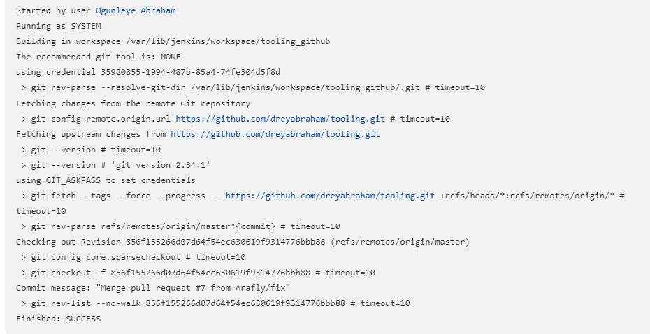
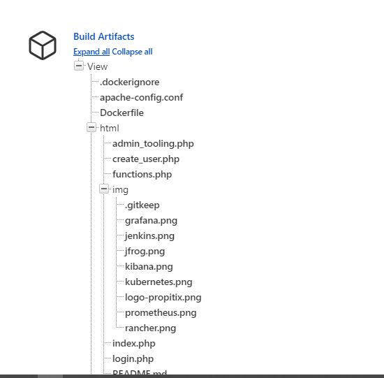
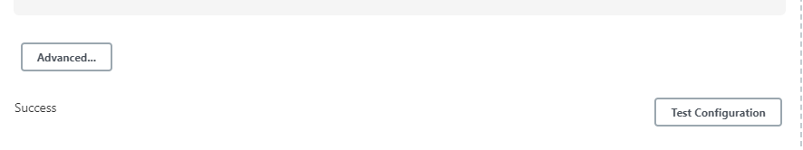
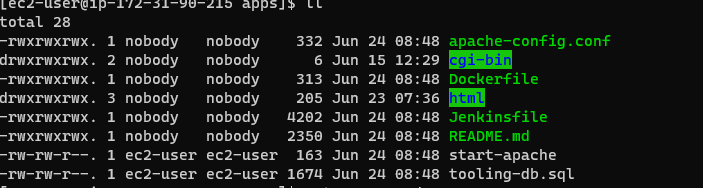
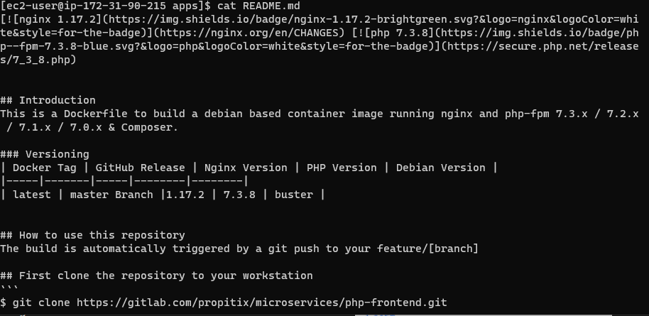

## DOCUMENTATION OF PROJECT 9

This project is all about continous Integration Pipeline For Tooling Website.

Firstly we install and configure jenkins using the commands below 
`sudo apt update`

`sudo apt install default-jdk-headless`

`wget -q -O - https://pkg.jenkins.io/debian-stable/jenkins.io.key | sudo apt-key add -`

`sudo sh -c 'echo deb https://pkg.jenkins.io/debian-stable binary/ > \/etc/apt/sources.list.d/jenkins.list`

`sudo apt update`

`sudo apt-get install jenkins`

make sure jenkins is up and running 
`sudo systemctl status jenkins`

Now we try to access jenkin from our web browser and configure it.

Configure Jenkins to retrieve source codes from GitHub using Webhooks.
Enable webhooks in your GitHub repository settings.

Go to Jenkins web console, click "New Item" and create a freestyle project.
Now we connecting to our github repository using the http url.

Save the configuration and let us try to run the build. For now we can only do it manually.

Above image shows that we have done our jenkins build.

But this build does not produce anything and it runs only when we trigger it manually. Let us fix it.

Click "Configure" your job/project and add needed configuration.

Now we can go ahead and make some change in any file in your GitHub repository (e.g. README.MD file) and push the changes to the master branch.

we will a new build has been launched automatically by webhook.

We have now configured an automated Jenkins job that receives files from GitHub by webhook trigger.

Configure Jenkins to copy files to NFS server via SSH. Firstly install "Publish Over SSH" plugin.

Configure the job/project to copy artifacts over to NFS server using the steps asked to follow.

Now test the configuration and make sure the connection returns Success.

Save the configuration, open your Jenkins job/project configuration page and add another one "Post-build Action"

Configure it to send all files probuced by the build into our previous define remote directory.

Now save this configuration and go ahead, change something in README.MD file in your GitHub Tooling repository.

Now we check the files in /mnt/apps to see if they have been updated.

We have just implemented  Continous Integration solution using Jenkins CI

## END OF PROJECT 9

